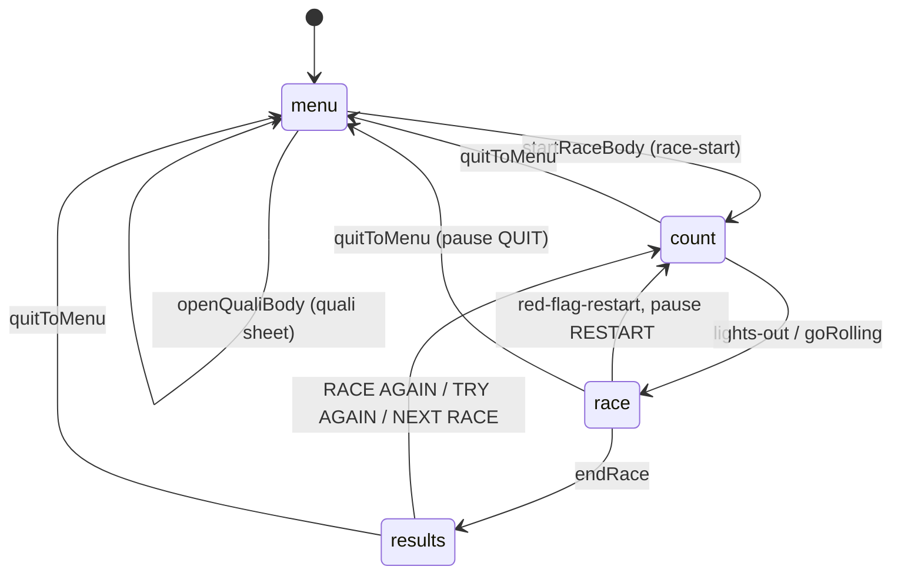

# Apex 26 — session flow (menu → race → results)

Read from `js/game.js` on the ship branch, not from memory. Function names, not line
numbers: the lines move every day, `grep` the name. Behaviour is described, not changed — if a
row below looks wrong, that is a finding for an issue, not an edit to this file.

## The state machine

`state` has exactly four values and ONE writer, `setState(next, why)` (it logs every
transition as `State a->b why=…`).

| `state` | entered by (`why`) | left by |
|---|---|---|
| `menu` | `quit` (`quitToMenu`), `quali-sheet` (`openQualiBody`) | `startRaceBody` → `count` |
| `count` | `race-start` (`startRaceBody`), `red-flag-restart` (`redFlagRestart`) | `lights-out` → `race`; `goRolling()` (`rolling-start`: a jump-in, WATCH from a lap, a designer test drive) → `race` |
| `race` | `lights-out`, `restart-green` (after a red flag), `rolling-start` | `endRace` → `results`; `quitToMenu` → `menu` |
| `results` | `endRace` (`flag`, `forced-order`, `quali-end`) | `quitToMenu` → `menu`; RACE AGAIN / TRY AGAIN / NEXT RACE → `startRace` → `count` |

`quitToMenu` is the one full teardown (HUD, lights, pause, rotate blocker, audio, session
entry, netplay, season reload, title overlay). `openQualiBody` is the one other writer of
`menu`: no race is up while the quali sheet is, so there is nothing to tear down. (The completed-season arm of
`startRaceBody` was a second one — it left the race chrome up — until it was changed to `quitToMenu`; see
the flow C PR "a start that finds the season finished".)

## Entering a session

Every start ends in `startRace()` → `SessionEntry.begin("race", key, prepare, commit, valid,
recover)` → `startRaceBody`. `key` is `entrySettings()` (track, flow, session, weather, laps,
team, grid, season round…).

- **superseded** (a newer start, or `quitToMenu` → `sessionEntry.cancel()`): the old request
  resolves `{kind:"canceled", reason:"superseded"}` and runs nothing.
- **settings changed** before commit (`valid()` false): `cancel()`, then `recover()` — for a
  race that is `quitToMenu()` — and `{kind:"canceled", reason:"settings changed"}`.
- **error**: `recover(e)` (`quitToMenu` + a "COULD NOT LOAD CIRCUIT" card), then the error rethrows.

`recover` is therefore a *quit*, never a hand-back of a previous race. A pause RESTART whose
`entrySettings()` changed in the async window ends on the title, not back in the old race.

| route | pre-race screen (garage → card → flyby) | calls |
|---|---|---|
| RACE! on RACE SETTINGS | yes (`raceIntroFromSheet`, sheet stays up as PREPARING…) | `raceIntro(startRace)` |
| Data Hub JUMP IN / WATCH | yes (`opts.intro`) | `raceIntro(startRace)` |
| designer TEST HERE | yes (a solo "my racing" start) | `raceIntro(go)`; `go` = `startRace`; the car is then placed on the point (`TrackDesigner.placeTest`) |
| qualifying GRID / DRIVE, season NEXT RACE, RACE AGAIN, TT TRY AGAIN | no — the build card covers the load | `startRaceCovered()` |
| pause RESTART | no | `startRace()` direct (disabled in a friend race) |
| red flag | no — re-grids in place | `redFlagRestart()` → `count` |

An intro that is abandoned (settings changed, or a stale request) ends in `titleIfBare()`:
it gives the sheet's buttons back and re-shows the title only when `state === "menu"` and no
screen is up.

While a designer test drive's return is armed (`CustomTracks.armReturn`), every
`startRace` that reaches its countdown calls `CustomTracks.afterStart()`, which puts the car
back on the test point and goes green: TRY AGAIN and RESTART return to the point, and
`quitToMenu` (via `consumeTrackHash`) reopens the designer.

## Leaving a session — what is shown at the flag, per mode

`endRace` runs once per session. Three presentation pieces can follow it: the **chequered cut +
orbit + highlights** (`ResultsCam.onFlag`), the **TV director** on the player's own car
(`Director`, `autoSpectate` once `player.finished` or `retired`), and the results surface.

| mode | ResultsCam (cheq → orbit → highlights) | TV director on own car | surface |
|---|---|---|---|
| solo GP / sprint / practice / duel | yes — if `enabled` (see below) | yes, after the player finishes | results sheet |
| season / career round | as GP | as GP | results sheet (+ career settlement) |
| time trial | **no** — `endRace` returns before `onFlag` | yes (the player finishes) | TT results |
| qualifying | **no** — returns to the quali sheet first | yes | quali sheet (`q-done`) |
| friend race (netplay) | **no** — `allowed()` is false while `netPlay.active()` | **no** — `wantOn` is false when `net` | results sheet, the host's classification |
| WATCH (RealRace replay) | **no** — `eligible()` is `!realRace.isWatch()` | **no** — the replay owns the picture | results sheet (published classification) |
| any mode on **mobile** / `PerfGov.tier() >= 2` | **no** — `enabled()` is false | as the row above | the last race frame **freezes** behind the sheet: `render()` returns early when `state === "results"` and the cam is not live |

Two consequences worth knowing before changing any of it:

1. TT and qualifying skip the cut that GP gets, yet still switch to TV once the player is done —
   the table is inconsistent by construction, not by a single decision.
2. On mobile (and under load) the results screen is a still image by design (unpaid work
   avoided); there is no per-mode override.

## Where to look

| question | read |
|---|---|
| what runs on quit | `quitToMenu` (`js/game.js`) |
| the async gap before a start | `js/race/session-entry.js`, `startRace` |
| the pre-race screen | `raceIntro`, `afterGarageOut`, `studioOpen`/`studioDone` |
| the finish | `endRace`, `js/camera/results-cam.js`, `js/camera/director.js` (`wantOn`) |
| results sheet and its buttons | `js/ui/results-sheet.js`, `els.resNext.onclick` |
| pause menu | `setPaused`, `#pm-restart` / `#pm-quit` handlers |
