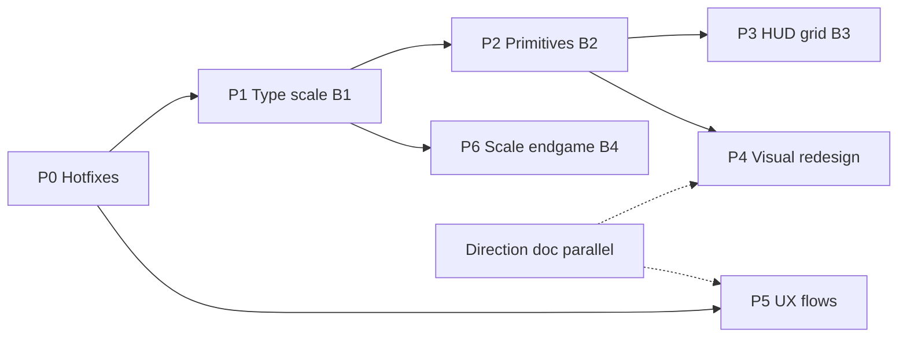

# Apex 26 — UI improvement program (design)

Dated 2026-08-05. Scope: **all four pillars** the player asked for —
structural finish (B1–B4), visual redesign, UX flow polish, and scaling
endgame — as one sequenced program, not one mega-PR.

Companion research already in-tree:

- [`docs/research/UI-DESIGN-PRINCIPLES.md`](../../research/UI-DESIGN-PRINCIPLES.md)
  — phone-first legibility; design systems should do less
- [`docs/research/UI-SCALE-AND-ZOOM.md`](../../research/UI-SCALE-AND-ZOOM.md)
  — why `zoom` is correct *now*, and when B4 may retire it
- [`docs/COMPONENTS.md`](../../COMPONENTS.md) — 516 classes / 55 families
- [`docs/LAYOUT-AUDIT.md`](../../LAYOUT-AUDIT.md) — measure-before-look matrix
- [`docs/AUDIT-2026-08.md`](../../AUDIT-2026-08.md) — a11y / layer findings

External anchors used for this design: MDN `zoom` vs `transform: scale`,
WAI-ARIA dialog modal pattern, Sinclair “secretly console first”, Cusick
“design systems should do less”, container-query / `cqi` fluid type guidance,
thumb-zone / critical-focus HUD practice for racing UIs.

---

## 1. Goal

Make Apex 26’s menus and in-race HUD feel like one deliberate product across
phone-landscape (the hard case), tablet, and desktop: legible at arm’s length,
consistent primitives, clear hierarchy and motion, reachable controls, and a
scale system that does not invent coordinate-space bugs.

Success is measured by the existing geometry probes and baselines, not by
screenshots alone:

1. `node tools/layout-audit.mjs` stays green across the screen × viewport ×
   scale matrix for every screen this program touches.
2. `tests/ui-scale.spec.js`, `tests/hud-layout.spec.js`,
   `tests/menu-keyboard.spec.js`, `tests/ui-button-touch.spec.js` stay green.
3. `tests/menu-baseline.spec.js` baselines are **intentionally** refreshed only
   when a visual phase lands — never as collateral of a token migration.
4. Raw `font-size: Npx` in menu stylesheets falls to a small allow-list of
   documented one-offs (hero titles, HUD digits).
5. Player can complete title → race → results and career hub on a 852×393
   landscape phone at UI SIZE 115% without clipped actions or horizontal scroll.

---

## 2. Approaches considered

| Approach | Shape | Verdict |
|---|---|---|
| **1. Waterfall only** | B1 → B2 → B3 → visual → UX → B4, strictly serial | Safe but slow; visual taste decisions wait for months of token work |
| **2. Foundation serial + parallel design track** | B1/bugs/B2/B3 land as code; visual direction + UX audit run as docs/mockups in parallel; visual CSS and UX flow edits land *after* B2 | **Chosen** — keeps the shell stable while taste work proceeds without fighting mid-migration tokens |
| **3. Vertical slices per screen** | Rebuild select end-to-end, then garage, then career… | Rejected — shared primitives would diverge again; B2 would be impossible |

**Chosen: Approach 2.** Code commits stay serial on the CSS cascade and the
shared primitives. Visual/UX work produces a locked direction doc first, then
implements against the post-B2 shell.

---

## 3. Non-negotiable constraints

These bind every phase:

1. **No frameworks.** Pure CSS + IIFE JS. No build step for the game.
2. **Phone landscape is the design target.** 852×393 / arm’s-length glance.
   Desktop may be generous; it must not dictate rungs.
3. **Do not edit `js/` or `css/` while a Playwright group is in flight.**
4. **Bump `?v=N` + `version.json` only as the last edit before commit** of a
   JS/CSS change — never mid-test-run.
5. **`zoom` stays until B1 is complete.** A half-migrated token scale plus no
   zoom is worse than zoom alone (`UI-SCALE-AND-ZOOM.md` §4).
6. **B2 collapses only what passes Cusick’s test:** used on ≥3 screens *and*
   generic enough for a fourth. Prefer slots (`.row-lead` / `.row-body` /
   `.row-meta`) over modifier piles. Expect ~20% of UI to stay local.
7. **Neither B1 nor B2 may increase the number of class families** in
   `docs/COMPONENTS.md`. They are subtractive.
8. **`@container sheet` absorbs layout branches** that currently live as
   viewport media queries in `responsive.css` when the question is sheet shape,
   not viewport chrome.
9. **Preserve Escape / `UiLayers` / `TopModal` contracts.** New screens go on
   `data-esc-close` and the `UiLayers` inventory; do not invent a second close
   path.
10. **Verification is serial and browser-bound.** Fan-out is for analysis and
    docs, not for concurrent Playwright groups on this 4-core box.

---

## 4. Program phases (sub-projects)

Each phase is its own implementation plan + PR train. Later phases may start
*analysis* early; they must not land CSS that assumes unfinished earlier tokens.



### P0 — Hotfix & contract repair (days of work, first)

Ship correctness that unblocks everything else. No new look.

| Item | Why |
|---|---|
| Restore `#track-detail` as a real `<dialog>` (or update TopModal/tests/docs to match current markup — pick **dialog**, matching PLATFORM-INPUT-NOTES) | Docs/tests say dialog; `index.html` currently a `div role=dialog` after a merge regression |
| Extend `AriaState` to `.on` (tuner time/weather, camera chips, Spotify toggles) | Audit §11 — selected state silent to AT |
| Ensure `UiLayers` / `ScrollFade` / `MenuNav` inventories stay single-sourced for every openable layer | Audit historically drifted; verify audioset / vsfriend / spotifypanel still listed |
| Fix zoomed/unzoomed consumers of `--cs-sheet-w` and remaining dock-width contracts | Garage camera bar under panel at primary 852×393 shape |
| Apply `#datahub` to `--ui-scale` (or document intentional exclusion and add a hub-scale token) | Hub ignores UI SIZE today |
| Kill duplicated photo-mode block in `tuner.css` | Drift risk |
| Raise sub-`--tap` targets (telemetry lane-remove 20×20, track-detail close 36×36) to the house ladder | WCAG 2.5.8 + house comfort |
| Feature-detect `currentCSSZoom` / rect space once; introduce `viewportRect()` helper for A13 sites | Safari &lt; 26.4 and mixed-space bugs |

**Exit:** `test:ui` green; layout-audit red cells for touched screens at 0 for
clip/overflow; no new visual baseline churn unless unavoidable.

### P1 — Type scale finish (B1)

Complete the migration already started in `components.css` and `data.css`.

- Seven rungs `--fs-1` … `--fs-7` (declare `--fs-7` only when a real consumer
  lands — `css-tokens.test.mjs` rejects unread tokens).
- **One stylesheet per commit**, with a before/after font-size dump in the
  commit message (PARALLEL-WORK.md).
- Migration order (remaining files): `menus.css` → `carsetup.css` →
  `career.css` → `overlays.css` → `tuner.css` → `hud.css` (HUD stays mostly
  off-scale by design; only migrate shared labels that belong on the scale) →
  `responsive.css` / `track-detail.css` mop-up.
- Phone-first: when a size is used as a phone floor and a desktop caption, map
  the phone use to the floor rung and let desktop sit on a higher rung — do not
  average.
- Keep hero titles and large HUD digits as documented one-offs.
- Optional within P1, not required: introduce `--space-*` spacing tokens for the
  densest offenders (`data.css`) — only if it does not expand B1 into a second
  project. Prefer a follow-on **P1b** if spacing scope grows.

**Exit:** raw menu `font-size: Npx` count under an allow-list asserted by a
tooling test; menu-baseline still matches *or* is refreshed with an explicit
“type migration intentional delta” note.

### P2 — Shared primitives (B2)

Collapse duplicated structure that already appears on ≥3 screens.

Candidate families (confirm with inventory agents before deleting locals):

| Primitive | Absorbs |
|---|---|
| `.row` + slots | `.res-row`, standings rows, driver list rows, dh-rows where structure matches |
| `.chip` / `.sel-chip` unification | chips across select / career / garage / tuner |
| `.opt` option button | `.cs-opt`, tuner opts, similar toggles |
| Section heading | `.sel-label` already shared — finish ownership in `components.css` only |

Also in P2:

- Move sheet-shape layout branches from viewport media queries into
  `@container sheet` where the existing header of `responsive.css` already
  asks for it.
- Native CSS nesting for the densest blocks (Baseline, no build step) — ergonomics
  only; no behaviour change.
- Update `docs/COMPONENTS.md` + `tests/component-inventory.test.mjs` as the
  governance gate.

**Exit:** fewer cross-file family owners; inventory test green; layout-audit
unchanged or greener; **class family count ≤ start**.

### P3 — HUD grid (B3)

One coherent in-race layout pass on the driving layer (`hud.css` +
`overlays.css` docks).

- Critical focus: keep the centre diamond (horizon + car) clear — racing HUD
  practice; do not grow centre chrome.
- Thumb zones: primary touch controls stay in lower left/right docks; pause and
  rare actions may sit higher.
- Express HUD clusters as an explicit grid/safe-area template so scale and
  notch compensation live in one place, not nine hand-written inset divisions.
- Independent `--hud-scale` remains; do not couple it to `--ui-scale`.
- Contextual minimalism: prefer collapsing secondary readouts under short
  landscape rather than shrinking type below the glance floor.

**Exit:** `hud-layout.spec.js` green across the existing matrix; no new
control↔HUD collisions; portrait rotate-device behaviour unchanged.

### Direction track (parallel with P0–P2, docs only)

While foundation lands, produce **one** locked direction doc (no CSS):

`docs/superpowers/specs/2026-08-05-ui-visual-direction.md` covering:

1. Visual north star (motorsport broadcast / night paddock — **not** purple
   gradients, cream+serif, or broadsheet). Preserve existing red/near-black/
   Titillium+Rajdhani DNA; raise hierarchy and motion, do not replace brand.
2. Motion budget: 2–3 intentional motions (sheet enter, primary CTA sheen/
   press, HUD caution pulse) — no perpetual noise.
3. First-viewport rules for title screen: brand hero, one headline, one CTA
   group — already close; tighten secondary clutter.
4. Density targets for select / garage / career at 852×393.
5. Before/after reference frames captured via Playwright (not DevTools MCP
   screenshots — known black-column false positive).

This track does **not** land CSS until P2 exits.

### P4 — Visual redesign (implements the direction doc)

Apply the locked direction to the post-B2 primitives:

- Title, select, garage, career hub, pause/settings first.
- Data hub and tuners second (more specialised).
- Refresh `menu-baseline` snapshots as an intentional gate.
- Prefer token and primitive changes over one-off screen CSS.
- Keep blur off the live canvas (mobile compositing cost).

**Exit:** baselines updated; layout-audit still green; player-facing “looks like
one game” across the four hero screens.

### P5 — UX flow polish

Can start small fixes in P0; larger IA changes wait until after P2 so DOM
structure is stable.

| Flow | Intent |
|---|---|
| Title → Select → Garage → Race settings → Race | Clearer primary path; fewer competing secondary actions on title |
| Career setup → hub → race | Hub hierarchy: next race, standings, offers without equal visual weight |
| Pause ladder | Settings / advanced / tuners / free-cam Escape steps stay one ladder |
| First-run / how-to-play | Shorter path to first green light |
| VS Friend lobby | Fit and focus trap parity with other dialogs |

DOM/flow changes go through `UiLayers` + `data-esc-close`. Prefer copy and
ordering over new screens.

**Exit:** keyboard and touch specs green; no new layer inventory drift; a short
manual checklist in the phase plan for title→race and career→race.

### P6 — Scale endgame (B4)

Only after P1 is complete (hard gate).

Decide, with measurements:

1. Keep `zoom` permanently for UI SIZE, with the compensation tokens — **or**
2. Drive `--fs-*` / spacing / control sizes from `--ui-scale` and retire `zoom`.

Retire only if:

- Type + spacing + control tokens cover ≥95% of scaled surfaces.
- `viewportRect()` / coordinate-space tests cover the A13 sites.
- Layout-audit at 80/100/115/130/150% matches or beats the zoomed baseline.
- Container-query × zoom open questions no longer apply (or are re-checked).

Until then, document remaining compensation sites as a checklist, not as debt
to ignore.

**Also deferred until verified on device:** CSS anchor positioning + Popover API
for `#campicker` (`UI-SCALE-AND-ZOOM.md` §5c) — silent failure risk under zoom.

---

## 5. Architecture (what we keep)

```text
index.html          static screen DOM + data-esc-close
css/tokens.css      scales, safe-area, type, radius, surfaces
css/components.css  .screen / .sheet / .pane / .pane-pair + shared primitives
css/<domain>.css    screen ownership (menus, carsetup, career, hud, …)
js/game/uilayers.js single top-layer inventory
js/game/topmodal.js hidden ↔ <dialog> bridge + Escape
js/game/sheetshape.js data-shape / data-pair for CSS
js/game/scrollfade.js / menunav.js / ariastate.js
tools/layout-audit.mjs  geometry matrix
tests/ui-*.spec.js      behavioural gates
tests/menu-baseline     visual identity gate
```

No new framework layer. New “components” are CSS class families + optional tiny
IIFE helpers, registered in `docs/COMPONENTS.md`.

---

## 6. Testing strategy

| Gate | When |
|---|---|
| `npm run test:tooling-fast` | every CSS/docs inventory edit |
| `node tools/verify` / pick-tests | after each phase’s code |
| `node tools/test-bg.mjs ui` | after P0, P1 file batches, P2, P3, P4, P5 |
| `node tools/layout-audit.mjs` | after P1–P4; `--scale=` axis for scale work |
| `menu-baseline` | refresh only in P4 (and P1 only if dump proves intentional delta) |
| Single-spec repro | any timing-shaped failure under load |

Never run more than one heavy Playwright group on this box.

---

## 7. Out of scope

- Rewriting the renderer, physics, or career rules.
- Adopting React/Vue/Svelte or a CSS preprocessor build.
- Committing SwiftShader track-visual baselines (separate outstanding work).
- Replacing Titillium/Rajdhani or the F1-red brand identity wholesale.
- Building a second parallel design system “for mobile”.

---

## 8. Delivery shape

1. This design doc lands first (this PR).
2. Implementation plans per phase under
   `docs/superpowers/plans/YYYY-MM-DD-ui-pN-<name>.md`.
3. Feature branches `cursor/ui-pN-<slug>-3284` off the program branch or deploy
   base as appropriate.
4. Each phase PR links this design and lists its exit criteria.
5. Direction doc for P4/P5 may land as a sibling PR with no CSS.

---

## 9. Spec self-review

- No TBD placeholders for decisions that block coding — B4 remains a
  **measured decision**, which is intentional.
- P1b spacing called out as optional split to avoid scope creep.
- Visual work cannot land before P2 — explicit.
- `#datahub` scale: prefer applying `--ui-scale`; exclusion only if measurement
  shows a conflict with hub’s own layout.
- `#track-detail`: choose native `<dialog>`, not doc downgrade.
